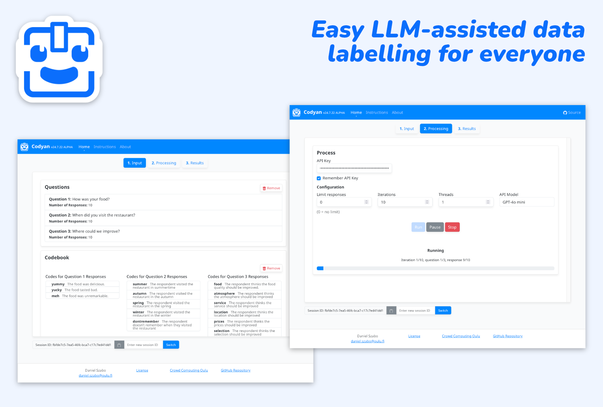

# Codyan
Large Language Model Qualitative Coder Application.

Use this to apply pre-made codes with descriptions to pieces of text, for example labelling questionnaire responses. 

Loosely based on the methods defined by [Tai et al.](https://journals.sagepub.com/doi/10.1177/16094069241231168) and [Xiao et al.](https://dl.acm.org/doi/abs/10.1145/3581754.3584136?casa_token=mzIRyelkNPYAAAAA%3An0wVsZFmoYH12VuQ84jmLfBFs_b3NwSGRxt6GtmyC2LxSteWuKicCSQe1t1SrQd5cLED0z147WLx)

## Usage

1. Make a copy of `/input_sample` directory named `/input`
2. Update the example files inside the `/input` directory with your own data
   1. Enter your codebook in `codes.csv`
   2. Enter the data you want to code in `responses.csv`
   3. Enter your reference, human-coded lines, if you have any, in `reference.csv` - this is for intercoder reliability calculations
3. Install dependencies with `pip install -r requirements.txt`
4. Run the Codyan with `python app.py`
5. Navigate to `http://127.0.0.1:8000`
6. [Obtain](https://help.openai.com/en/articles/4936850-where-do-i-find-my-openai-api-key) and enter your OpenAI API key
7. Follow the on-screen instructions to load your input data, your codeset, perform coding and analyse your results
8. Find your results in the `/output` folder and on-screen. The used prompts are also saved in `/output/prompts.csv`

With any questions, feel free to contact me at [daniel.szabo@oulu.fi](mailto:daniel.szabo@oulu.fi)

### Docker

If you prefer to run Codyan as a docker container, you can build the image and run it as follows:

1. Build image with `docker build --tag codyan .`
2. Run image with `docker run -d -p 8000:5000 codyan` where 8000 is the port you will access the application at